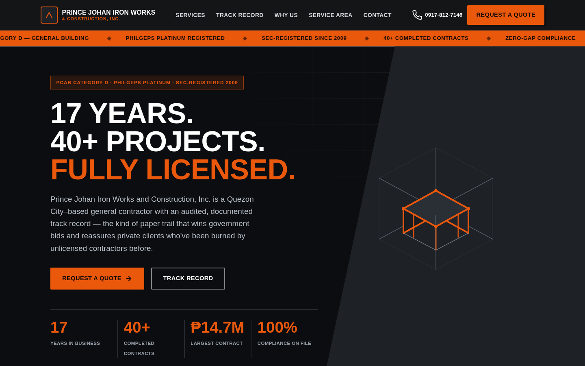

# Prince Johan Iron Works and Construction, Inc. — Website

Official company website. A single self-contained `index.html` — inline CSS and JS,
no build step, no framework, no runtime dependencies. The only external request is
Google Fonts.

**Live:** https://norrisgabrielfontanilla-cell.github.io/princejohanconstruction/



---

## Design

Industrial identity built for a contractor whose pitch is its compliance record:

| | |
|---|---|
| Palette | Charcoal `#0B0D10` / `#16191D` with safety orange `#EA580C` |
| Display type | Archivo Black — poster-scale, uppercase |
| Body type | Inter |
| Surface | Warm paper `#F4F2EC` against the charcoal |

Signature elements: a scrolling credentials marquee under the header, a diagonal-cut
hero, offset hard shadows on buttons, an asymmetric bento service grid, and
editorial-numbered project cards with oversized ghost numerals.

---

## Company details on the site

All content comes from verified company records:

| | |
|---|---|
| Legal name | Prince Johan Iron Works and Construction, Inc. |
| SEC registration | 21 May 2009 |
| PCAB licence | Category D, General Building |
| Procurement | PhilGEPS Platinum (government bidding eligible) |
| Head office | 11-A Meleguas St., Torres Subdivision, Tandang Sora District 6, Quezon City 1116 |
| Phone | 0917-812-7146 |
| Email | princejohan2009@gmail.com |
| Completed contracts | 40+ |
| Contract value range on file | ₱636,133 – ₱14,722,050 |

Individual project cards deliberately show **"Value on file"** rather than per-project
figures — only the aggregate range above is verified, so no per-project numbers were
invented.

---

## Repository layout

```
index.html                              the entire website
README.md                               this file
docs/
  screenshots/                          renders of each section of the live site
  alternates/
    isometric-hero.html                 alternate design (see below)
    generate-isometric-scene.py         generator for its hero SVG
    isometric-hero-desktop.png          what it looks like
    isometric-scene.png                 the raw scene
.github/workflows/deploy-pages.yml      auto-deploys to GitHub Pages on push to main
```

---

## Page structure

1. **Header** — sticky, with the phone number and a persistent quote CTA
2. **Marquee** — PCAB / PhilGEPS / SEC / 40+ contracts, scrolling
3. **Hero** — headline, stat row (17 / 40+ / ₱14.7M / 100%), dual CTA
4. **Trust bar** — the four credentials as diamond badges
5. **Services** — six cards in an asymmetric bento grid
6. **Track record** — eight completed contracts
7. **Why us** — the six compliance documents, all current
8. **Service area** — Ilocos Sur, Metro Manila, Cavite, plus nationwide eligibility
9. **Contact** — details and an inquiry form
10. **Footer** — credentials repeated, licence details

---

## Accessibility and SEO

- Skip link, semantic landmarks, `<address>` for NAP data
- Visible focus rings; interactive targets ≥ 44px
- Verified zero horizontal overflow at 320 / 360 / 390 / 414 / 768 / 1024 / 1440px
- Marquee animation disabled under `prefers-reduced-motion: reduce`
- `schema.org` `GeneralContractor` JSON-LD with address, service area and credentials
- Location-specific copy naming Quezon City, Ilocos Sur, Metro Manila and Cavite

---

## Known limitation

**The contact form is not wired to a backend.** It validates on the client only —
nothing is sent anywhere on submit. This is stated plainly on the form itself, which
directs visitors to phone or email instead. Connecting it to a form service
(Formspree, Netlify Forms, Google Apps Script) is a small change to the submit
handler at the bottom of `index.html`.

---

## Alternate design

`docs/alternates/isometric-hero.html` is a complete, working alternative built around
a full-viewport animated isometric construction site — a concrete skeleton frame,
scaffolding, three lattice tower cranes, a glass podium and a timber site office, with
crane hooks that raise and lower, a hoist climbing the frame, blinking beacons and
vehicles on the road. It uses a lighter palette and a floating pill navbar.

It is **not deployed**. To make it live, replace `index.html` with it.

Its hero SVG is generated, not hand-drawn:

```bash
python3 docs/alternates/generate-isometric-scene.py
```

The script projects 3D grid coordinates to 2D —

```
screen_x = (x - y) * 30
screen_y = (x + y) * 15 - z * 26
```

— and draws each building as three shaded faces (top lightest, right mid, left
darkest). It writes an SVG fragment to paste inside the `<svg>` in the `.hero-bg`
block, replacing the existing `<g id="scene">…</g>`.

---

## Deployment

Pushing to `main` triggers `.github/workflows/deploy-pages.yml`, which publishes the
repository root to GitHub Pages. No build, no install step.

Pages must be set to **Settings → Pages → Source: GitHub Actions** — already
configured, only ever needs doing once.
